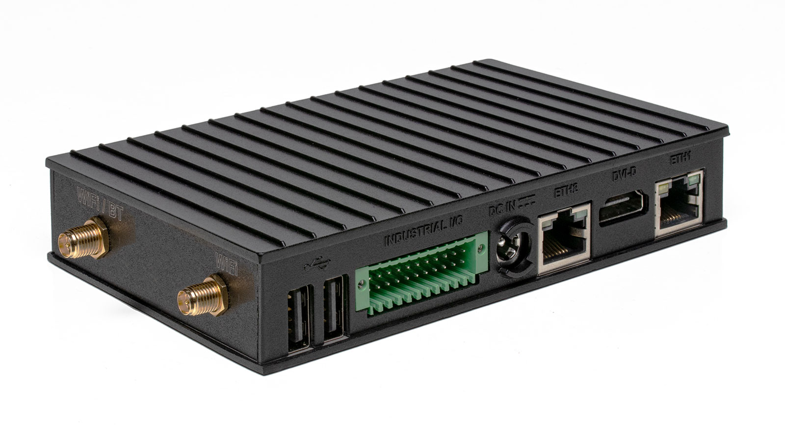

# Compulab IOT-GATE-IMX8PLUS

This is the base Nerves System configuration for the
[Compulab IOT-GATE-IMX8PLUS](https://www.compulab.com/products/iot-gateways/iot-gate-imx8plus-industrial-arm-iot-gateway).


<br><sup>[Image credit](#compulab)</sup>

| Feature        | Description                                                 |
| -------------- | ----------------------------------------------------------- |
| CPU            | 1.8 GHz quad-core Cortex-A53 (64-bi)                        |
| NPU            | AI/ML Neural Processing Unit, up to 2.3 TOPS                |
| MCU            | ARM Cortex-M7, 800Mhz                                       |
| Storage        | eMMC                                                        |
| Linux kernel   | 6.1                                                         |
| IEx terminal   | UART `ttymxc1`                                              |
| GPIO, I2C, SPI | Yes - [Elixir Circuits](https://github.com/elixir-circuits) |
| Display        | Yes                                                         |
| Ethernet       | Yes                                                         |
| WiFi           | Yes                                                         |
| Bluetooth      | Yes                                                         |
| RTC            | Yes                                                         |
| HW Watchdog    | Yes                                                         |

[Image credit](#compulab): This image is from
[compulab.com](https://www.compulab.com/products/iot-gateways/iot-gate-imx8plus-industrial-arm-iot-gateway).

### Getting started

The IOT-GATE-IMX8PLUS gateway expects the bootloader to be located on hardware BOOT partition 1. When flashing firmware, ensure that both the bootloader and a complete disk image, generated using the fwup CLI tool, are provided.

#### Prerequisites

- [NXP mfgtools](https://github.com/nxp-imx/mfgtools)
- [fwup](https://github.com/fwup-home/fwup)

#### Building a firmware image

```
fwup -a \
  -d $FW_PROJECT_DIR/_build/$TARGET/nerves/images/firmware.img \
  -i $FW_PROJECT_DIR/_build/$TARGET/nerves/images/firmware.fw  \
  -t complete
```

#### Flashing the firmware image

```
uuu \
  -b emmc_all \
  $BINARIES_DIR/imx8-boot-sd.bin \
  $FW_PROJECT_DIR/_build/$TARGET/nerves/images/firmware.img
```

#### Flashing only U-Boot

```
uuu -b emmc $BINARIES_DIR/imx8-boot-sd.bin
```
