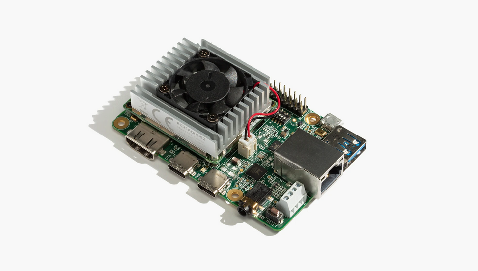

# Google Coral Devboard

This is the base Nerves System configuration for the
[Google Coral Devboard](https://coral.ai/products/dev-board).

 [Image credit](#google)

| Feature        | Description                                                 |
| -------------- | ----------------------------------------------------------- |
| CPU            | 1.8 GHz quad-core Cortex-A53 (64-bi)                        |
| NPU            | AI/ML Neural Processing Unit, up to 2.3 TOPS                |
| MCU            | ARM Cortex-M7, 800Mhz                                       |
| Storage        | eMMC                                                        |
| Linux kernel   | 6.1                                                         |
| IEx terminal   | UART `ttymxc1`                                              |
| GPIO, I2C, SPI | Yes - [Elixir Circuits](https://github.com/elixir-circuits) |
| Display        | Yes                                                         |
| Ethernet       | Yes                                                         |
| WiFi           | Yes                                                         |
| Bluetooth      | Yes                                                         |
| RTC            | Yes                                                         |
| HW Watchdog    | Yes                                                         |

[Image credit](#google): This image is from
[coral.ai](https://coral.ai/products/dev-board).
